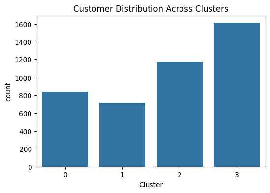
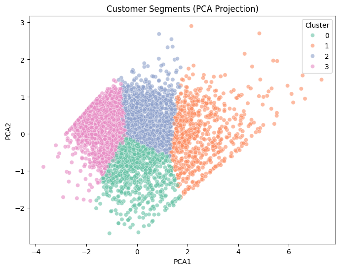

# Customer Segmentation Analysis using RFM and K-Means

## 📌 Project Overview

This project performs end-to-end customer segmentation using the RFM (Recency, Frequency, Monetary) framework and K-Means clustering.

The objective is to identify distinct customer groups based on purchasing behavior and derive actionable marketing strategies to improve retention and revenue.

---

## 🎯 Business Problem

E-commerce companies often struggle to:

- Identify high-value customers  
- Detect customers at risk of churn  
- Personalize marketing campaigns  
- Optimize retention strategies  

This project addresses these challenges by segmenting customers into behavior-based groups using transactional data.

---

## 📂 Dataset

- **Source:** Online Retail Dataset  
- **Provider:** UCI Machine Learning Repository  
- ~500,000 transaction records from a UK-based online retailer (2010–2011)

Each transaction includes:

- InvoiceNo  
- InvoiceDate  
- Quantity  
- UnitPrice  
- CustomerID  

After cleaning, the dataset contains:

- ~398,000 valid transactions  
- 4,338 unique customers  

---

## 🧹 Data Cleaning

The following preprocessing steps were applied:

- Removed transactions with missing `CustomerID`  
- Excluded returns (negative Quantity)  
- Removed invalid pricing records  
- Created `TotalPrice = Quantity × UnitPrice`  

---

## 🧠 Feature Engineering (RFM)

RFM metrics were calculated per customer:

- **Recency:** Days since last purchase  
- **Frequency:** Number of unique invoices  
- **Monetary:** Total amount spent  

To prepare for clustering:

- Applied log transformation to reduce skewness  
- Standardized features using `StandardScaler`  

---

## 🔍 Model Selection

K-Means clustering was applied to the scaled RFM features.

To determine the optimal number of clusters:

- Elbow Method was used to evaluate within-cluster variance  
- Silhouette Score was computed for K = 2 to 10  

Although K=2 produced the highest silhouette score (~0.43), K=4 was selected to create more actionable and business-relevant customer segments while maintaining reasonable cluster separation (~0.33).

---

## 📊 Customer Segments Identified

| Cluster | Segment Name | Description |
|----------|--------------|-------------|
| 1 | VIP / Champions | Recent, high-frequency, high-spending customers |
| 0 | New / Occasional | Recent but low-frequency customers |
| 2 | Loyal but Cooling | Moderate spenders with declining recency |
| 3 | Dormant / Lost | Inactive, low-frequency, low-value customers |

---

## 📈 Visualizations

### Customer Distribution Across Clusters

### Standardized RFM Comparison

### PCA Projection of Clusters

---

## 💡 Business Recommendations

- **VIP Customers:** Loyalty rewards, premium offers, early access programs  
- **Loyal but Cooling:** Re-engagement campaigns and personalized incentives  
- **New Customers:** Upsell and cross-sell strategies  
- **Dormant Customers:** Win-back campaigns or cost-based targeting  

---

## 🛠 Tools & Technologies

- Python  
- Pandas  
- NumPy  
- Seaborn & Matplotlib  
- Scikit-learn  
- PCA (Dimensionality Reduction)  
- K-Means Clustering  

---

## 🚀 Key Takeaways

- A small percentage of customers (VIP segment) generate the majority of revenue.  
- Large customer base does not necessarily imply high value.  
- Behavioral segmentation enables targeted and cost-efficient marketing strategies.  
- Proper feature scaling and skewness handling are critical for distance-based clustering models.  

---

## 📜 License

This project is licensed under the MIT License.
